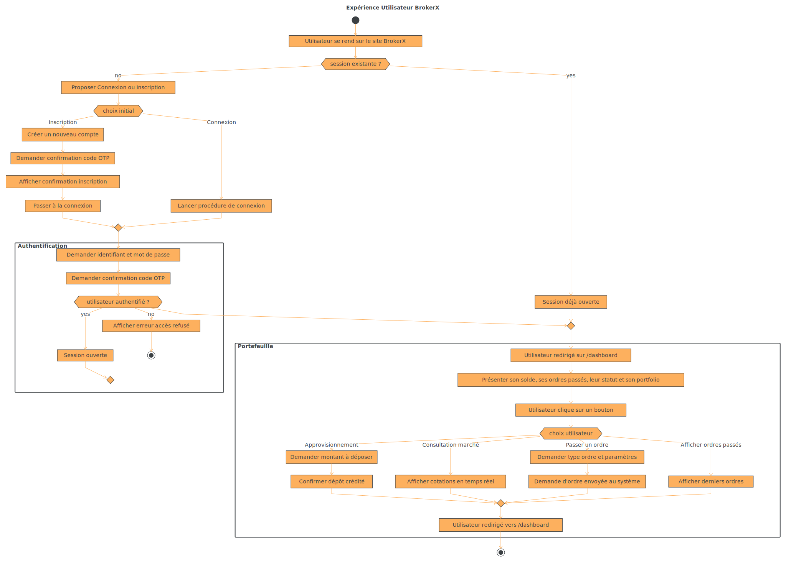

# BrokerX - Documentation d'Architecture

Ce document, basé sur le modèle arc42, décrit une application de courtage en ligne pour les particuliers.

## 1. Introduction et Objectifs

### Panorama des exigences

L'application « BrokerX » est un système monolithique avec interface en ligne de commande qui permet aux particuliers et petites entreprises d'accéder à une plateforme de courtage moderne en ligne. L'application permet aux clients de :

- Passer des ordres
- Consulter leurs portefeuilles
- Recevoir exécutions et confirmations
- Effectuer le règlement et la compensation des transactions​

### Objectifs qualité

| Priorité | Objectif qualité  | Scénario                                              |
| -------- | ----------------- | ----------------------------------------------------- |
| 1        | **Disponibilité** | 90,0 % (monolithique)                                 |
| 2        | **Performance**   | Latence (ordre → ACK) ≤ 500 ms & Débit ≥ 300 ordres/s |
| 3        | **Observabilité** | Logs + métriques (4 Golden Signals) dès la phase 2    |

### Parties prenantes (Stakeholders)

<!-- TODO: tiré du cahier des charges, à réécrire ? -->

- **Clients** : utilisateurs via interface web/mobile.

- **Opérations Back-Office** : gestion des règlements, supervision.
  **Risque** : surveillance pré- et post-trade.

- **Fournisseurs de données de marché** : cotations en temps réel.

- **Bourses externes** : simulateurs de marché pour routage d’ordres.​

## 2. Contraintes d'architecture

| Contrainte      | Description                                                               |
| --------------- | ------------------------------------------------------------------------- |
| **Technologie** | Les plateformes/langages serveur privilégiées : Java, C#, Go, Rust ou C++ |

<!-- TODO: jsp si je dois pas juste écrire Rust ici ^ -->

## 3. Portée et contexte du système

### Contexte métier

Le système permet aux utilisateurs de :

- Gérer le compte utilisateur
- Approvisionner et retirer des fonds
- Passer des ordres d'achat/vente
- Consulter l'état des ordres et le portefeuille
- Consulter les données du marché

#### Priorisation MoSCoW

- Must Have
  - UC-01 — Inscription & Vérification d’identité
  - UC-03 — Approvisionnement du portefeuille (dépôt virtuel)
  - UC-05 — Placement d’un ordre (marché/limite) avec contrôles pré-trade
- Should Have
  - UC-07 — Appariement interne & Exécution (matching)
  - UC-06 — Modification / Annulation d’un ordre
- Could Have
  - UC-08 — Confirmation d’exécution et Notifications
  - UC-02 — Authentification & MFA
  - UC-04 — Abonnement aux données de marché
- Won't Have

#### UC-01 — Inscription & Vérification d’identité

**Objectif** : ​Permettre à un nouvel utilisateur de créer un compte sur la plateforme en fournissant ses informations personnelles, de vérifier son identité selon les exigences réglementaires (KYC/AML) et d’activer son accès à la plateforme. Ce cas établit la relation de confiance initiale entre l’utilisateur et BrokerX.

**Acteur principal** : Client​

**Déclencheur** : L’utilisateur souhaite créer un compte.​

**Pré-conditions** : Aucune.​

**Postconditions (succès)** : Compte créé en état Pending et changer à Active après validation.​

**Postconditions (échec)** : Compte non créé ou marqué Rejected avec raison.

**Flux principal (succès)** :

- Le Client fournit email/téléphone, mot de passe, données personnelles requises (nom, adresse, date de naissance).​
- Le Système valide le format, crée un compte en Pending, envoie un lien de vérification email/SMS.​
- Le Client confirme le lien OTP (one-time passwords)/MFA (multi-factor authentication).​
- Le Système passe le compte à Active et journalise l’audit (horodatage, empreinte des
  documents).​

  **Alternatifs / Exceptions​** :

* A1. Vérif email non complétée : compte reste Pending (rappel, expiration après X jours).​
* E1. Doublon (email/tel déjà utilisés) : rejet, proposition de récupération de compte.

#### UC-03 — Approvisionnement du portefeuille (dépôt virtuel)

**Objectif** : Donner aux utilisateurs la possibilité de créditer leur portefeuille virtuel en effectuant des dépôts simulés, afin de disposer de liquidités nécessaires pour placer des ordres d’achat. Ce cas assure la disponibilité des fonds pour les opérations boursières.

**Acteur principal** : Client​

**Secondaires** : Service Paiement Simulé / Back-Office​

**Déclencheur** : Le Client crédite son solde en monnaie fiduciaire simulée.​

**Préconditions** : Compte Active.​

**Postconditions (succès)** : Solde augmenté, écriture comptable ajoutée (journal immuable).​

**Postconditions (échec)** : Solde inchangé.

**Flux principal** :

- Le Client saisit le montant.​
- Le Système valide limites (min/max, anti-fraude).​
- Le Système crée une transaction Pending.​
- Le Service Paiement Simulé répond Settled.​
- Le Système crédite le portefeuille, journalise et notifie.​

  **Alternatifs / Exceptions​** :

* A1. Paiement async : passe Pending, solde crédite à confirmation.​
* E1. Paiement rejeté : état Failed, notification avec motif.​
* E2. Idempotence : si retry reçu avec même idempotency-key, renvoyer le résultat précédent.

#### UC-05 — Placement d’un ordre (marché/limite) avec contrôles pré-trade

**Objectif** : Permettre aux clients de soumettre des ordres d’achat ou de vente (marché ou limite), qui seront validés par des contrôles pré-trade et insérés dans le moteur d’appariement. Ce cas constitue le cœur fonctionnel de la plateforme de courtage.

**Acteur principal** : Client​

**Secondaires** : Moteur de Règles Pré-trade, Gestion des Risques, Comptes/Portefeuilles​

**Déclencheur** : Le Client soumet un ordre.​

**Préconditions** : Session valide, portefeuille existant.​

**Postconditions (succès)** : Ordre accepté (ACK) et placé dans le carnet interne.​

**Postconditions (échec)** : Ordre rejeté avec raison.

**Flux principal (succès)** :

- Le Client renseigne symbole, sens (Achat/Vente), type (Marché/Limite), quantité, prix (si limite), durée (DAY/IOC…).
- Le Système normalise les données et horodate l’opération (timestamp système en UTC avec millisecondes ou nanosecondes).
- Contrôles pré-trade
  - Pouvoir d’achat / marge disponible,​
  - Règles de prix (bandes, tick size),​
  - Interdictions (short-sell si non autorisé),​
  - Limites par utilisateur (taille max, notionals),​
  - Sanity checks (quantité > 0, instrument actif).​
- Si OK, le Système attribue un OrderID, persiste, achemine au Moteur d’appariement interne.

**Alternatifs / Exceptions​** :

- A1. Type Marché : prix non requis, routage immédiat.​
- A2. Durée IOC/FOK : logique spécifique au matching (voir UC-07).​
- E1. Pouvoir d’achat insuffisant : Reject avec motif.​
- E2. Violation bande de prix : Reject.​
- E3. Idempotence : même clientOrderId → renvoyer résultat précédent.

### Contexte technique

- Environnement d'execution

  - **Interface** : Application monolithique Rust avec interface Web.
  - **Déploiement** : Docker, Cargo
  <!-- TODO docker ? -->

- **Dépendances externes**
  - **Base de données relationnelle** (ex. PostgreSQL, SQLite pour le proto) pour stocker :
    - Comptes utilisateurs
    - Ordres et transactions
    - Portefeuilles
  - **Fournisseur de données de marché**.
- **Interfaces utilisateurs**
  - Interface web

## 4. Stratégie de solution

<!-- TODO: compléter ça -->

| Problème                           | Approche de solution                                                                      |
| ---------------------------------- | ----------------------------------------------------------------------------------------- |
| **Performance**                    | Utilisation du langage Rust                                                               |
| **Besoin d'un prototype évolutif** | Architecture monolithique modulaire avec séparation claire des responsabilités            |
| **Gestion des données**            | Base relationnelle (**PostgreSQL** en production, **SQLite** pour le développement/proto) |
| **Rapports statistiques**          | Traitement direct depuis Redis pour éviter la charge sur MySQL                            |

## 5. Vue des blocs de construction

## 6. Vue d'exécution

## 7. Vue de déploiement

## 8. Concepts transversaux

?

## 9. Décisions d'architecture

<!-- TODO: les lister -->

## 10. Exigences qualité

### Performance

- Temps de réponse optimisé pour les requêtes Redis
- Support de charges élevées simultanées
- Rapports statistiques générés sans impact sur MySQL

### Maintenabilité

- Séparation claire CQRS entre commands/ et queries/
- Code modulaire avec responsabilités bien définies
- Synchronisation automatique et cohérence des bases de données

### Évolutivité

- Architecture préparée pour l'ajout de nouveaux types de rapports
- Extensibilité du système de cache Redis
- Support de nouvelles entités métier

## 11. Risques et dettes techniques

Non applicable pour cette application.

## 12. Glossaire

| Terme                      | Définition                                                                                                                                                                                                          |
| -------------------------- | ------------------------------------------------------------------------------------------------------------------------------------------------------------------------------------------------------------------- |
| **CQRS**                   | Command Query Responsibility Segregation : séparation des opérations de lecture et d'écriture                                                                                                                       |
| **DDD**                    | Domain-Driven Design : approche de conception logicielle qui nous permet de gérer la complexité d'une application en séparant les responsabilités par domaine et en utilisant la conception tactique et stratégique |
| **ORM**                    | Object-Relational Mapping : technique de mapping entre objets et base de données relationnelle                                                                                                                      |
| **Persistance polyglotte** | Utilisation de plusieurs technologies de stockage pour différents besoins                                                                                                                                           |
