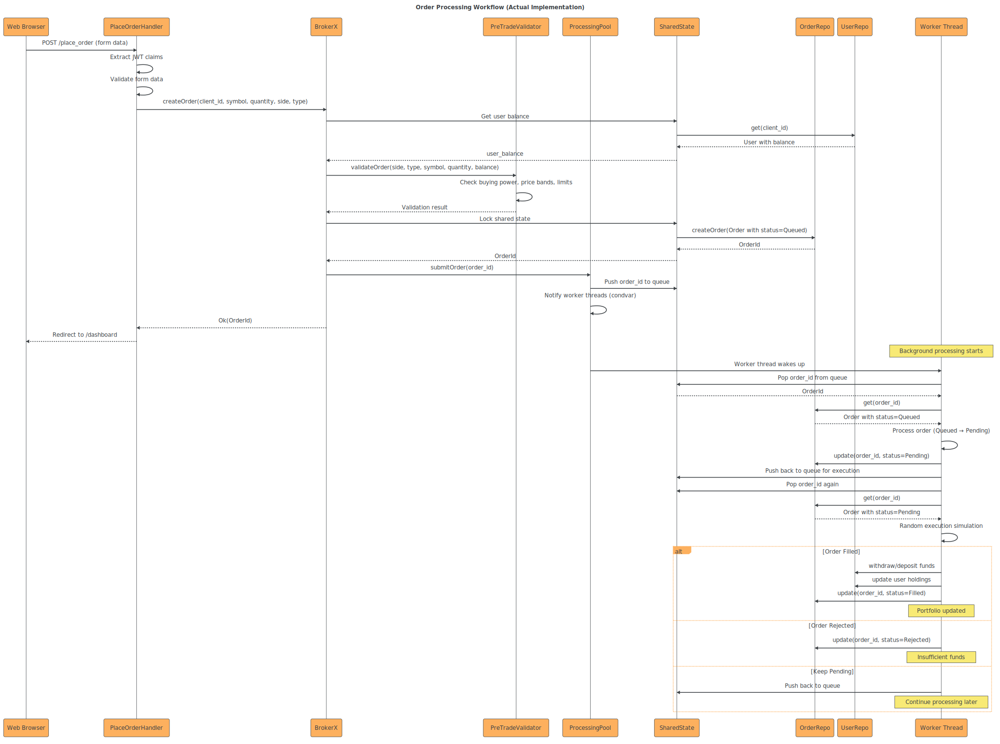

# BrokerX - Documentation d'Architecture

Ce document, basé sur le modèle arc42, décrit une application de courtage en ligne pour les particuliers.

## 1. Introduction et Objectifs

### Panorama des exigences

L'application « BrokerX » est un système monolithique avec interface web qui permet aux particuliers et petites entreprises d'accéder à une plateforme de courtage moderne en ligne. L'application permet aux clients de :

- Gérer un portefeuille personnel (solde, historique),
- Passer des ordres d'achat/vente d'instruments financiers (actions),
- Consulter les données de marché en temps réel.

### Objectifs qualité

| Priorité | Objectif qualité  | Scénario                                              |
| -------- | ----------------- | ----------------------------------------------------- |
| 1        | **Disponibilité** | 90,0 % (monolithique)                                 |
| 2        | **Performance**   | Latence (ordre → ACK) ≤ 500 ms & Débit ≥ 300 ordres/s |
| 3        | **Observabilité** | Logs + métriques (4 Golden Signals) dès la phase 2    |

### Parties prenantes (Stakeholders)

- **Clients** : utilisateurs via interface web.

- **Opérations Back-Office** : gestion des règlements, supervision.
  **Risque** : surveillance pré- et post-trade.

- **Fournisseurs de données de marché** : cotations en temps réel.

- **Bourses externes** : simulateurs de marché pour routage d’ordres.​

## 2. Contraintes d'architecture

| Contrainte      | Description                                                               |
| --------------- | ------------------------------------------------------------------------- |
| **Technologie** | Les plateformes/langages serveur privilégiées : Java, C#, Go, Rust ou C++ |

<!-- TODO: jsp si je dois pas juste écrire Rust ici ^ -->

## 3. Portée et contexte du système

### Contexte métier

Le système permet aux utilisateurs de :

- Gérer le compte utilisateur
- Approvisionner et retirer des fonds
- Passer des ordres d'achat/vente
- Consulter l'état des ordres et le portefeuille
- Consulter les données du marché

#### Priorisation MoSCoW

- Must Have
  - UC-01 — Inscription & Vérification d’identité [FAIT]
  - UC-03 — Approvisionnement du portefeuille (dépôt virtuel) [FAIT]
  - UC-05 — Placement d’un ordre (marché/limite) avec contrôles pré-trade [FAIT]
- Should Have
  - UC-07 — Appariement interne & Exécution (matching) [NON FAIT]
  - UC-06 — Modification / Annulation d’un ordre [NON FAIT]
- Could Have
  - UC-08 — Confirmation d’exécution et Notifications [NON FAIT]
  - UC-02 — Authentification & MFA [FAIT]
  - UC-04 — Abonnement aux données de marché [NON FAIT]
- Won't Have

#### UC-01 — Inscription & Vérification d’identité

Ce cas d'utilisation est le point d'entrée d'un nouvel utilisateur sur la plateforme BrokerX. L'inscription comprend les étapes suivantes :

- Le client remplit un formulaire d'inscription avec des informations de base (email, mot de passe, etc).
- Le système envoie un email de vérification avec un code à 6 chiffres.
- Le client saisit le code pour vérifier son identité.
- Le système active le compte utilisateur

Si l'utilisateur tente de se connecter sans avoir vérifié son email, il est invité à compléter le processus de vérification. Ainsi, il ne peut effectuer aucune action avant d'avoir validé son identité.

#### UC-03 — Approvisionnement du portefeuille (dépôt virtuel)

Ce cas d'utilisation permet à un utilisateur de déposer des fonds sur son compte BrokerX. Le processus comprend les étapes suivantes :

- L'utilisateur se connecte à son compte.
- Il navigue vers la section "Approvisionnement".
- Il saisit le montant à déposer .
- Le système valide le montant (positif, limites).
- Le système crédite le portefeuille de l'utilisateur avec le montant déposé. (dépôt virtuel)

#### UC-05 — Placement d’un ordre (marché/limite) avec contrôles pré-trade

Ce cas d'utilisation permet à un utilisateur de passer un ordre d'achat ou de vente d'instruments financiers. Le processus comprend les étapes suivantes :

- L'utilisateur se connecte à son compte.
- Il navigue vers la section "Passer un ordre".
- Il remplit le formulaire d'ordre avec les détails (type, quantité, prix, etc).
- Le système valide le formulaire (champs obligatoires, formats).
- Le système effectue des contrôles pré-trade (solvabilité, limites de risque).
- L'utilisateur est redirigé vers son tableau de bord où l'ordre apparaît avec le statut "En attente".
- Le traitement de l'ordre est effectué de manière asynchrone dans un pool de threads.
- Son statut est mis à jour automatiquement (Exécuté, Rejeté, etc) dans le tableau de bord.

### Contexte technique

- Environnement d'execution

  - **Interface** : Application monolithique Rust avec interface Web.
  - **Déploiement** : Docker (base de données), Cargo (application)

- **Dépendances externes**
  - **Base de données relationnelle** (PostgreSQL) pour stocker :
    - Comptes utilisateurs
    - Ordres et transactions
  - **Fournisseur de données de marché**.
- **Interfaces utilisateurs**
  - Interface web

## 4. Stratégie de solution

<!-- TODO: compléter ça -->

| Problème                           | Approche de solution                                                           |
| ---------------------------------- | ------------------------------------------------------------------------------ |
| **Performance**                    | Utilisation du langage Rust                                                    |
| **Besoin d'un prototype évolutif** | Architecture monolithique modulaire avec séparation claire des responsabilités |
| **Gestion des données**            | Base relationnelle (**PostgreSQL**)                                            |
| **Rapports statistiques**          |                                                                                |

## 5. Vue des blocs de construction

### 5.1 Vue d'ensemble du système (Niveau 1)

Le système BrokerX suit une architecture hexagonale (ports et adaptateurs) qui sépare clairement :

- **Le coeur métier** : logique de domaine pure sans dépendances externes
- **Les adaptateurs primaires** : interfaces utilisateur (Web, CLI)
- **Les adaptateurs secondaires** : infrastructure (base de données, service MFA, etc)

### 5.2 Architecture du domaine (Niveau 2)

Le coeur du système est organisé autour de l'agrégat principal `BrokerX` qui coordonne :

- `ProcessingPool` avec `SharedState` : traitement asynchrone des ordres avec état partagé
- `UserRepo` et `OrderRepo` : repositories pour la persistance (contenus dans `SharedState`)
- `PreTradeValidator` : validation des règles de risque pré-trade
- `MfaService` : authentification multi-facteurs (via mfa_adapter)

### 5.3 Ports et Adaptateurs (Niveau 3)

L'implémentation hexagonale respecte le principe d'inversion de dépendance :

- **Ports primaires** : définissent les cas d'utilisation métier
- **Ports secondaires** : définissent les besoins d'infrastructure
- **Adaptateurs** : implémentations concrètes des ports

### 5.4 Structure modulaire (Niveau 4)

L'organisation en crates Rust respecte la séparation des responsabilités :

- **domain** : logique métier pure (core, order_processing, user, order, portfolio, pre_trade)
- **app** : orchestration et interface web (Axum + Askama + templates)
- **database_adapter** : persistance PostgreSQL
- **mfa_adapter** : services d'authentification multi-facteurs
- **in_memory_adapter** : implémentation en mémoire pour les tests

### 5.5 Détail du traitement des ordres

Le flux de traitement des ordres illustre l'architecture réactive :

1. **Réception** via l'interface web (handlers Axum)
2. **Validation pré-trade** avec contrôles de risque
3. **Traitement asynchrone** dans un pool de threads
4. **Persistance** avec gestion des états d'ordre

## 6. Vue d'exécution

### 6.1 Parcours utilisateur complet

Ce diagramme de séquence illustre l'ensemble des interactions utilisateur dans le système BrokerX, de l'inscription initiale jusqu'à la gestion complète du portefeuille. Il couvre tous les cas d'usage implémentés :

#### Flux principaux documentés :

1. **Inscription et vérification d'identité (UC-01)**

   - Création de compte avec validation email
   - Processus de vérification par code à 6 chiffres
   - Activation du compte utilisateur

2. **Authentification et MFA (UC-02)**

   - Connexion sécurisée avec email/mot de passe
   - Authentification multi-facteurs obligatoire
   - Génération et validation de tokens JWT

3. **Approvisionnement du portefeuille (UC-03)**

   - Dépôt virtuel de fonds

4. **Placement d'ordres avec contrôles pré-trade (UC-05)**

   - Validation des formulaires d'ordre
   - Contrôles de risque et de solvabilité
   - Traitement asynchrone par le ProcessingPool

5. **Traitement d'ordres en arrière-plan**
   - Workers threads pour l'exécution des ordres
   - Transitions d'état (Queued → Pending → Filled/Rejected)
   - Mise à jour automatique des portefeuilles

## 7. Vue de déploiement

1. **BrokerX Container**

   - **Runtime** : Binaire Rust compilé statiquement
   - **Framework** : Axum avec runtime Tokio asynchrone
   - **Port** : 3000 (configurable via variables d'environnement)

2. **PostgreSQL Container**
   - **Base de données** : PostgreSQL
   - **Persistance** : Volume Docker pour la durabilité des données
   - **Connection pooling** : Géré par SQLx côté application

## 8. Concepts transversaux

- Architecture héxagonale
- Persistance (Postgresql)

## 9. Décisions d'architecture

<!-- TODO: les lister -->

- [ADR-001](../adr/adr001.md) - Adoption de l'architecture hexagonale
- [ADR-002](../adr/adr002.md) - Choix de la technologie web
- [ADR-003](../adr/adr003.md) -Adoption des UUIDs comme identifiants pour les clients et les ordres
- [ADR-004](../adr/adr004.md) - Choix de la technologie de journeaux de logs
- [ADR-005](../adr/adr005.md) - Implémentation du traitement des ordres

## 10. Exigences qualité

Une crate Rust dédiée à l'analyse des performances a été développée.

Les performances sont actuellement limitées par la base de données PostgreSQL.

## 11. Risques et dettes techniques

- **Complexité du traitement asynchrone** : Le traitement des ordres dans un pool de threads introduit une complexité supplémentaire. Une mauvaise gestion peut entraîner des conditions de course ou des blocages (double lock sur un mutex par exemple).

## 12. Glossaire

| Terme        | Définition                                                       |
| ------------ | ---------------------------------------------------------------- |
| Ordre        | Instruction d'achat ou de vente d'un instrument financier        |
| Portefeuille | Ensemble des actifs financiers détenus par un utilisateur        |
| MFA          | Authentification multi-facteurs                                  |
| JWT          | JSON Web Token, format de token sécurisé pour l'authentification |
